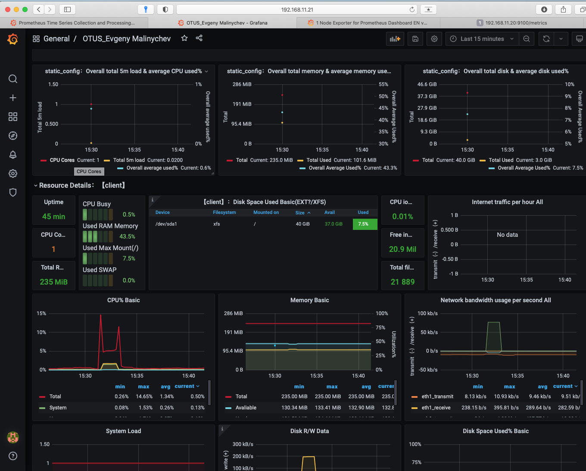
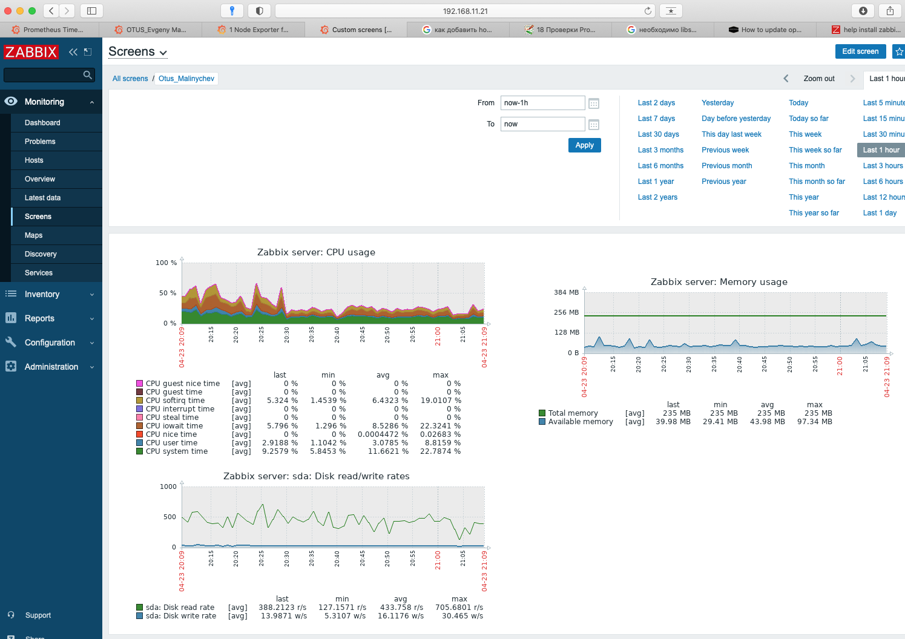

# Домашнее задание №18

		Настроить дашборд с 4-мя графиками
		1) память
		2) процессор
		3) диск
		4) сеть

		настроить на одной из систем
		- zabbix (использовать screen (комплексный экран))
		- prometheus - grafana
	
		* использование систем примеры которых не рассматривались на занятии

## Prometheus+Grafana

Для Prometheus+Grafana создал роли на ansible.

		vagrant up

После того как ВМ развернутся

**Prometheus** будет доступен по адресу

		http://192.168.11.21:9090/graph

**Grafana**

		http://192.168.11.21:3000

Далее с помощью импорта добавил дашборд в *grafana*. Дашборд взял 11074.



## Zabbix
### Сервер
На одну виртуальную машину установил Zabbix 5.0 по мануалу с официального сайта [ссылка](https://www.zabbix.com/ru/download?zabbix=5.0&os_distribution=red_hat_enterprise_linux&os_version=7&db=mysql&ws=apache)

В документации не описана установка mysql. 
Установил mariadb.

		yum install mariadb-server
		systemctl start mariadb
		systemctl enable mariadb

Также сервер не запускался пока не отключил selinux. Не стал "курить" мануал по данному вопросу )

### Клиент
Репозиторий на клиента ставить такой же как и для сервера

		yum -y install zabbix-agent

Отредактировать /etc/zabbix/zabbix_agentd.conf

		Server=
		ServerActive=
		Hostname=client # имя вашего узла мониторинга, которое будет указано на сервере zabbix

		systemctl start zabbix-agent
		systemctl enable zabbix-agent

На сервере Configuration -> Hosts добавил хост, который необходимо мониторить с шаблоном Template OS Linux by Zabbix agent.
На центральной консоли (Monitoring -> Dashboards -> Global View) добавил три новых дашборда



вышел затык с установкой агента не смог победить 
```
[root@client openssl-1.1.0f]# sudo yum install zabbix-agent zabbix-get
Загружены модули: fastestmirror
Determining fastest mirrors
 * base: mirror.reconn.ru
 * extras: mirror.reconn.ru
 * updates: mirror.yandex.ru
base                                                                                                                          | 3.6 kB  00:00:00     
extras                                                                                                                        | 2.9 kB  00:00:00     
updates                                                                                                                       | 2.9 kB  00:00:00     
zabbix                                                                                                                        | 2.9 kB  00:00:00     
zabbix-non-supported                                                                                                          | 3.0 kB  00:00:00     
(1/6): base/7/x86_64/group_gz                                                                                                 | 153 kB  00:00:00     
(2/6): extras/7/x86_64/primary_db                                                                                             | 232 kB  00:00:00     
(3/6): zabbix/x86_64/primary_db                                                                                               |  62 kB  00:00:01     
(4/6): zabbix-non-supported/x86_64/primary_db                                                                                 | 2.0 kB  00:00:01     
(5/6): updates/7/x86_64/primary_db                                                                                            | 7.1 MB  00:00:02     
(6/6): base/7/x86_64/primary_db                                                                                               | 6.1 MB  00:00:02     
Разрешение зависимостей
--> Проверка сценария
---> Пакет zabbix-agent.x86_64 0:5.2.6-1.el8 помечен для установки
--> Обработка зависимостей: libssl.so.1.1(OPENSSL_1_1_0)(64bit) пакета: zabbix-agent-5.2.6-1.el8.x86_64
--> Обработка зависимостей: libcrypto.so.1.1(OPENSSL_1_1_0)(64bit) пакета: zabbix-agent-5.2.6-1.el8.x86_64
--> Обработка зависимостей: libssl.so.1.1(OPENSSL_1_1_1)(64bit) пакета: zabbix-agent-5.2.6-1.el8.x86_64
--> Обработка зависимостей: libcrypto.so.1.1()(64bit) пакета: zabbix-agent-5.2.6-1.el8.x86_64
--> Обработка зависимостей: libssl.so.1.1()(64bit) пакета: zabbix-agent-5.2.6-1.el8.x86_64
---> Пакет zabbix-get.x86_64 0:5.2.6-1.el8 помечен для установки
--> Обработка зависимостей: libssl.so.1.1(OPENSSL_1_1_1)(64bit) пакета: zabbix-get-5.2.6-1.el8.x86_64
--> Обработка зависимостей: libcrypto.so.1.1(OPENSSL_1_1_0)(64bit) пакета: zabbix-get-5.2.6-1.el8.x86_64
--> Обработка зависимостей: libssl.so.1.1(OPENSSL_1_1_0)(64bit) пакета: zabbix-get-5.2.6-1.el8.x86_64
--> Обработка зависимостей: libssl.so.1.1()(64bit) пакета: zabbix-get-5.2.6-1.el8.x86_64
--> Обработка зависимостей: libcrypto.so.1.1()(64bit) пакета: zabbix-get-5.2.6-1.el8.x86_64
--> Проверка зависимостей окончена
Ошибка: Пакет: zabbix-get-5.2.6-1.el8.x86_64 (zabbix)
            Необходимо: libssl.so.1.1()(64bit)
Ошибка: Пакет: zabbix-get-5.2.6-1.el8.x86_64 (zabbix)
            Необходимо: libssl.so.1.1(OPENSSL_1_1_1)(64bit)
Ошибка: Пакет: zabbix-get-5.2.6-1.el8.x86_64 (zabbix)
            Необходимо: libcrypto.so.1.1(OPENSSL_1_1_0)(64bit)
Ошибка: Пакет: zabbix-agent-5.2.6-1.el8.x86_64 (zabbix)
            Необходимо: libcrypto.so.1.1()(64bit)
Ошибка: Пакет: zabbix-agent-5.2.6-1.el8.x86_64 (zabbix)
            Необходимо: libssl.so.1.1()(64bit)
Ошибка: Пакет: zabbix-agent-5.2.6-1.el8.x86_64 (zabbix)
            Необходимо: libssl.so.1.1(OPENSSL_1_1_0)(64bit)
Ошибка: Пакет: zabbix-agent-5.2.6-1.el8.x86_64 (zabbix)
            Необходимо: libssl.so.1.1(OPENSSL_1_1_1)(64bit)
Ошибка: Пакет: zabbix-get-5.2.6-1.el8.x86_64 (zabbix)
            Необходимо: libssl.so.1.1(OPENSSL_1_1_0)(64bit)
Ошибка: Пакет: zabbix-agent-5.2.6-1.el8.x86_64 (zabbix)
            Необходимо: libcrypto.so.1.1(OPENSSL_1_1_0)(64bit)
Ошибка: Пакет: zabbix-get-5.2.6-1.el8.x86_64 (zabbix)
            Необходимо: libcrypto.so.1.1()(64bit)
 Вы можете попробовать --skip-broken чтобы обойти проблему
 Вы можете попробовать запустить: rpm -Va --nofiles --nodigest
 ```

 при этом 
 ```
 [root@client]# openssl_latest version
OpenSSL 1.1.0f  25 May 2017
```