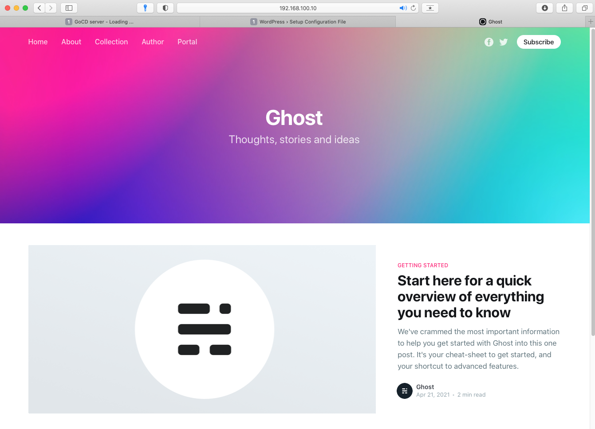
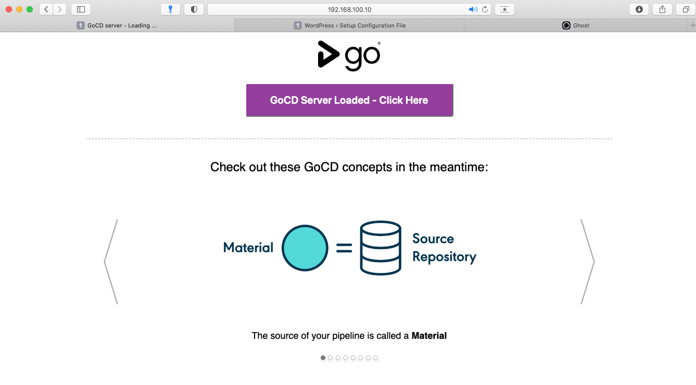
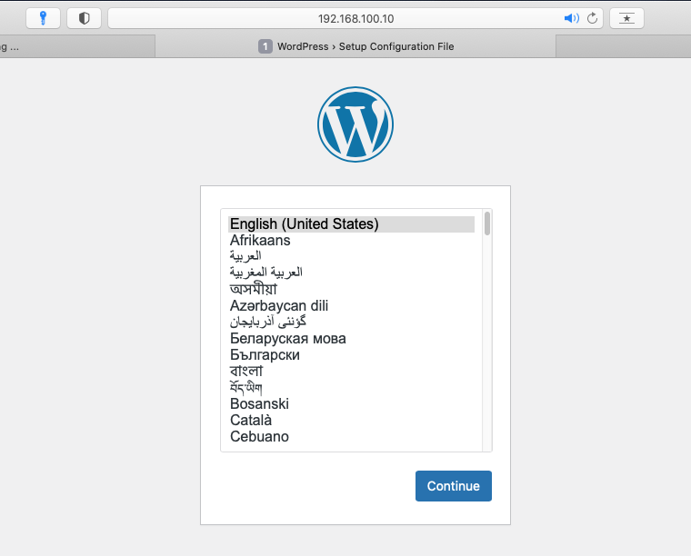

# Домашнее задание №26 Развертывание веб приложения
## Условие

Реализация стенда nginx + wordpress + ghost + gocd, каждый порт на свой сайт

http://192.168.100.10:2001 -> 8153 - gocd # go  
http://192.168.100.10:2002 -> 80 - wordpress # php  
http://192.168.100.10:2003 -> 2368 - ghost # js

Сервисы запускаются через docker-compose  
Nginx выполняет proxy_pass на указанные порты

